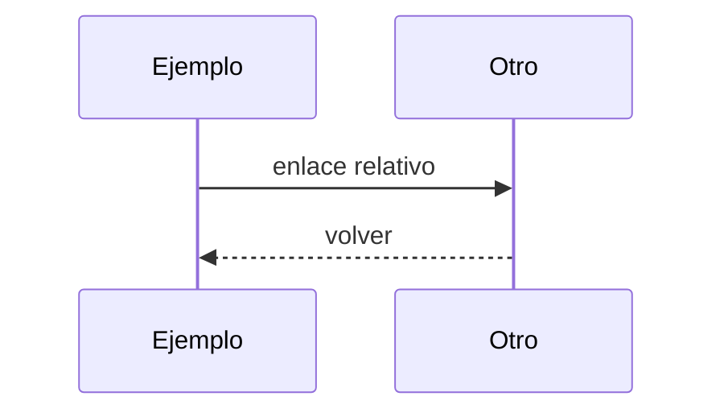

# Otro documento

Este archivo se abrió desde un **enlace relativo** en `ejemplo-completo.md`.

[← Volver al ejemplo completo](ejemplo-completo.md#diagramas-mermaid)

```mermaid
sequenceDiagram
    Ejemplo->>Otro: enlace relativo
    Otro-->>Ejemplo: volver
```
